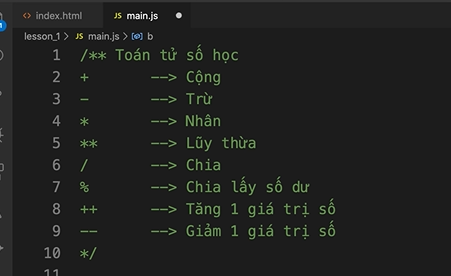
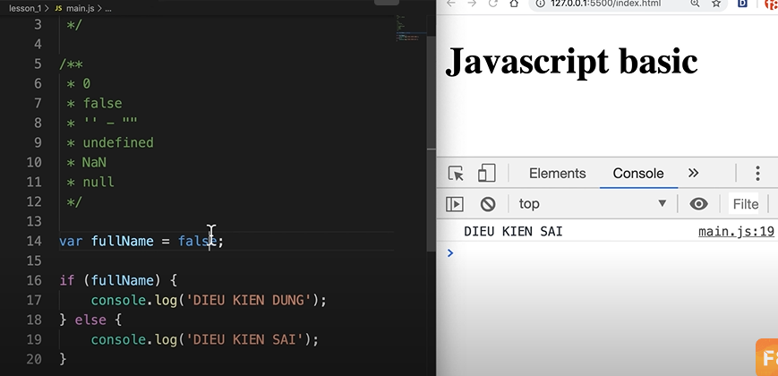
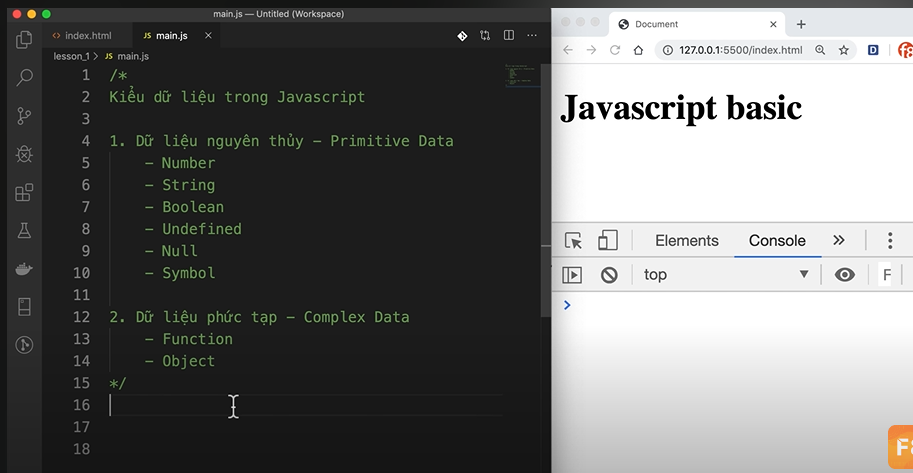

# Learning-Javascript

# I. Kiến thức cơ bản

# I. Hàm Built-In  trong JS

1. Alert
alert('Hello ae wibu')

2. Console
Console.log()
Console.err()

3. Confirm
 
var isConfirm = Confirm('Xac nhan ban du tuoi')

console.log(isConfirm)
4. Prompt

prompt("Nhap tuoi cua ban: ")

5. Set Timeout

setTimeout(function() {
    alert('Nofiti')
}, 2000)

Sau 2s sẽ thực hiện function

6. Set Interval

setInterval(function() {
    console.log("Siuuuuu")
}, 2000)

Cứ 2s thì sẽ chạy làm hàm function()

# II. Operator

```js
var a = 1
var b = 2

if (a > 0 && b > a) {
    alert('a > b Siuuu')
}
```



Có 6 giá trị dưới đây khi trong so sánh sẽ bằng false




- Toán tử so sánh `===` và `==`, `!==` và `!=`

Thằng `==` và `!=` sẽ chỉ so sánh giá trị, và ko quan tâm kiểu dữ liệu
```js
var a = 1
var b = '1'
console.log(a==b) //In ra true

console.log(a===b) //In ra false, Lúc này nó sẽ so sánh cả kiểu dữ liệu
```

# III. Kiểu dữ liệu 



```js
var myObject = {
    name: 'Viet',
    age: 18,
    myFunc: function() {

    }
}

console.log(myObject)
```

# III. HTML Dom

Gồm 3 thành phần:
- Element
- Attribute
- Text 

Tóm lại `DOM` là toàn bộ trang web của chúng ta, chứa các element như các thẻ `div, h1, br, ...`, nó cũng chứa luôn các `attribute` và `text`. Vì vậy khi muốn update webSite, ta sẽ sử dụng DOM để thêm, sửa, xóa mọi các `attibute`, `text`, `element`.

VD, Ta muốn thêm 1 dòng vào html của ta thì làm như sau:
```js
document.write('Hello Guys')
```

## 3.1 Get elements methods.

Để có thể get được element ta có thể lấy qua các cách sau: `ID, class, tag(div, h1, h2,...), CSS selector, HTML collection`

- `ID`: Chỉ get được 1 phần tử

```js
var heading1 = document.getElementById('heading');
document.write(heading1.textContent)
```

- `class`: Get được nhiều phần tử

```js
var siuNodes = document.getElementsByClassName('siuu')
document.write(siuNodes[1].textContent)
```

- `Tag`: Get được nhiều phần tử

```js
var sigTags = document.getElementsByTagName('h1')
document.write(sigTags[0].textContent)
```