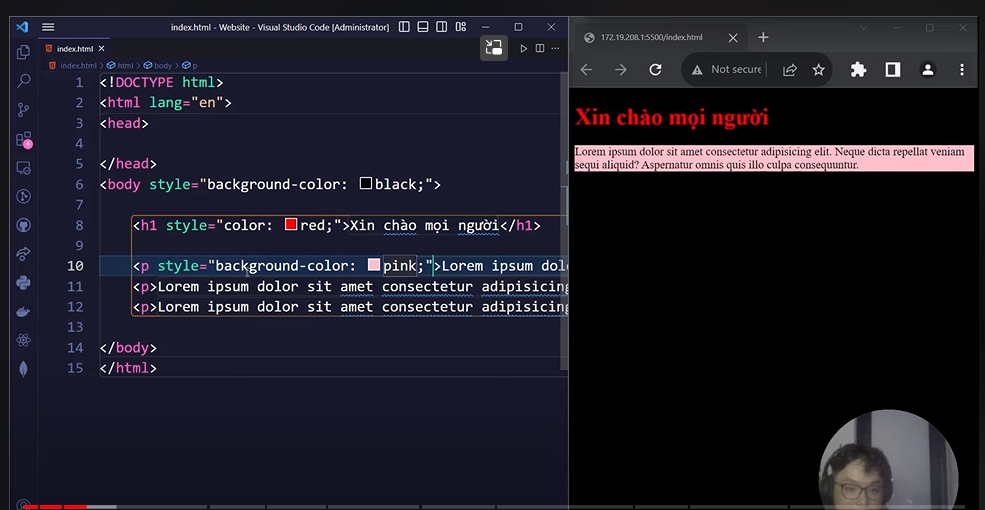
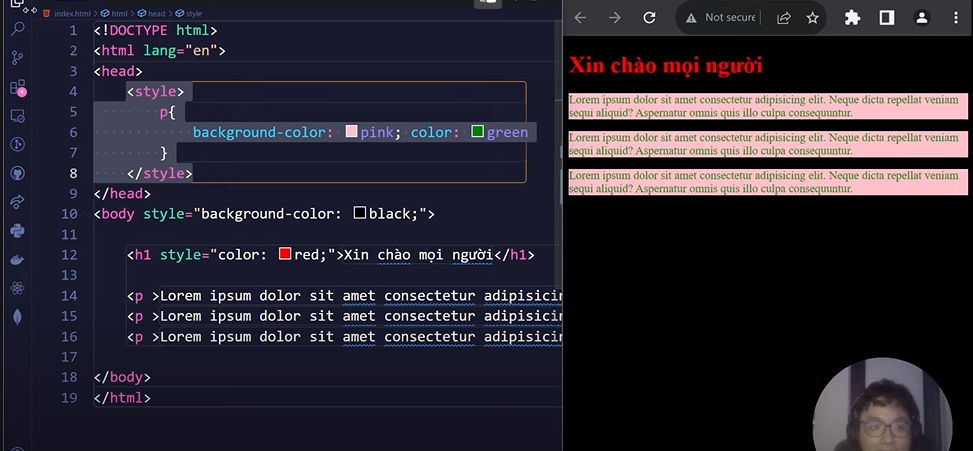

# Learning CSS

# I. Cú pháp

Được chia làm 2 phần:
- Selector: sẽ trỏ đến những đối tượng(html) chịu ảnh hưởng bởi CSS
- declaration: các thuộc tính CSS dùng để style cho thẻ Selector.

```CSS
h1 {
        background: red;
        color: blue
}
```

# II. Ta viết Css ở đâu

Có 3 cách viết:
- `Inline`: Viết trực tiếp trên thẻ thông qua thuộc tính `style`



- `Internal`: Viết tại file html hiện tại và nằm trong `thẻ style`



- `External`: viết riêng một thẻ có phần đuôi .css rồi sau đó import vào bằng thẻ link.

- Chúng ta cần tạo một file style.css (có phần mở rộng là .css) và sau đó import vào file HTML thông qua thẻ link. 
B1, Tạo một file style.css với nội dung sau:
```Css      
div{
    background:red; 
    color: blue;
}
```

B2: Tạo một file index.html cùng cấp với file style.css với nội dung sau:
```Css
<link href="style.css" rel="stylesheet"/>
<div>HỌC CSS MIỄN PHÍ TẠI FREETUTS.NET</div>
```
trong thẻ link có một thẻ href, ta sẽ truyền đường dẫn đến file CSS của bạn, `rel="stylesheet`" báo cho trình duyệt đây là file CSS

# III. Selectors

Như ta biết trong một file HTML thì có rất nhiều thẻ giống nhau và thông thường chúng ta sẽ đặt các `ID`, `class` cho các thẻ để phân biệt. `Selector` được sử dụng để chọn đối tượng(là thẻ nào của html) mà sẽ áp dụng css lên nó:

Có 3 loại `Selector` chính:
- CSS Selecto phân cấp
- CSS Selector ID
- CSS Selector Class

## 3.1. Selector phân cấp

Phân cấp nghĩa là dựa vào cấp cha để tìm cấp con:

Ví dụ ta muốn xét color màu đỏ nằm trong thẻ div:

```html
<div>
    <p>
            Nội dung sẽ có màu đỏ vì nó nằm trong thẻ p.
    </p>
</div>
<p>
Nội dung không có màu vì nó nằm ngoài thẻ p.
</p>
```

Và ở file css

```css
div p {
    color: red
}
```

Ta thấy `div p`, thì tag `p là cấp con div` sẽ có các thuộc tính kia

## 3.2 Selector ID

Trong một trang web ID là duy nhất nhé, nghĩa là nếu ta định nghĩa hai ID giống nhau trong 1 layout thì không đúng chuẩn giao diện của W3C. Giả sử ta có nhiều thẻ `div` và bạn muốn viết `CSS` cho một thẻ `DIV` nào đó thôi thì ta có thể chọn giải pháp là` Selector theo ID của HTML`. Chúng ta sử dụng dấu thăng `#` để đại diện cho `ID`.

```html
<div id="siuNhan">Hello ae siu nhân</div>
<p id="QuanQue">Quần què</div>
```

- Cách 1:

```css
#siuNhan {
    color: burlywood;
}
```

- Cách 2:

```css
div#QuanQue {
    background-color:teal;
}
```

## 3.3 Selector class

Với ID là duy nhất thì class ngược lại, nghĩa là bạn có thể cho nhiều thẻ HTML có cùng tên class, điều này khá tiện lợi cho CSS. Ví dụ ta cần style cho một số thẻ `div` nào đó thôi thì nếu bạn dùng `ID` thì không hay lắm vì phải viết nhiều lần, chính vì vậy ta sẽ chọn `class`. `Selector cho class` sẽ là dấu chấm `.`


```html
<div class="classViet">  Quần đùi  </div>
```

```css
.classViet {
    background-color: black;
    color:blueviolet;
}
```

Giả sử ta có 2 class đính cho thẻ `div` và `p`, nhưng ta chỉ muốn thẻ `div` được gắn style. Thì ta chỉ cần thêm tên thẻ `div` đằng trước dấu `.` là được.